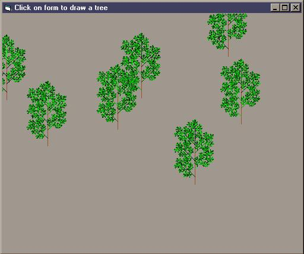

<div align="center">

## Leafy trees


</div>

### Description

Draws leafy trees where the user clicks the mouse. The code uses a recursive branch drawing method, and it can be tinkered to make many different types of trees.
 
### More Info
 
Paste the code into a form.


<span>             |<span>
---                |---
**Submitted On**   |
**By**             |[Dan McCuaig](https://github.com/Planet-Source-Code/PSCIndex/blob/master/ByAuthor/dan-mccuaig.md)
**Level**          |Intermediate
**User Rating**    |4.8 (24 globes from 5 users)
**Compatibility**  |VB 6\.0
**Category**       |[Graphics](https://github.com/Planet-Source-Code/PSCIndex/blob/master/ByCategory/graphics__1-46.md)
**World**          |[Visual Basic](https://github.com/Planet-Source-Code/PSCIndex/blob/master/ByWorld/visual-basic.md)
**Archive File**   |[](https://github.com/Planet-Source-Code/dan-mccuaig-leafy-trees__1-23687/archive/master.zip)


### Source Code

```
'DrawTree - draws a tree recursively. Each recursion draws a branch,
'and then joins on five offshoots
'
'Parameters:
' x0 : start x location
' y0 : start y location
' h : height of tree
' a : angle of branch in degrees
' limit : how far to fork branches
' color of current branch
Sub DrawTree(ByVal x0 As Double, ByVal y0 As Double, ByVal h As Double, ByVal a As Double, ByVal limit As Integer, Optional ByVal colour As Long = -1)
  Dim x1 As Double, y1 As Double
  Dim x2 As Double, y2 As Double
  Dim x3 As Double, y3 As Double
  Dim x4 As Double, y4 As Double
  Dim x5 As Double, y5 As Double
  Dim rad As Double
  Const pi As Double = 3.141592654
  Const d2r As Double = pi / 180
  If limit > 0 Then
    If colour = -1 Then
      colour = RGB(0, Rnd * 256, 0)
    End If
    rad = a * d2r    'convert angle to radians
    'get locations for tree branch offshoots
    '20% up the branch
    x1 = x0 + 0.2 * h * Cos(rad)
    y1 = y0 + 0.2 * h * Sin(rad)
    '40% up the branch
    x2 = x0 + 0.4 * h * Cos(rad)
    y2 = y0 + 0.4 * h * Sin(rad)
    '60% up the branch
    x3 = x0 + 0.6 * h * Cos(rad)
    y3 = y0 + 0.6 * h * Sin(rad)
    '80% up the branch
    x4 = x0 + 0.8 * h * Cos(rad)
    y4 = y0 + 0.8 * h * Sin(rad)
    '100% up the branch
    x5 = x0 + h * Cos(rad)
    y5 = y0 + h * Sin(rad)
    'Draw branch
    Line (x0, y0)-(x5, y5), colour
    'Draw offshoots
    DrawTree x1, y1, h * 0.4, a - 45, limit - 1 '-45degrees off
    DrawTree x2, y2, h * 0.4, a + 45, limit - 1 '+45degrees off
    DrawTree x3, y3, h * 0.4, a - 45, limit - 1
    DrawTree x4, y4, h * 0.4, a + 45, limit - 1
    DrawTree x5, y5, h * 0.4, a - 45, limit - 1
    DrawTree x5, y5, h * 0.4, a, limit - 1
  End If
End Sub
Private Sub Form_MouseDown(Button As Integer, Shift As Integer, X As Single, Y As Single)
  'Draw tree with start color of brown
  DrawTree X, Y, 1000, -90, 6, RGB(160, 82, 45)
End Sub
```

